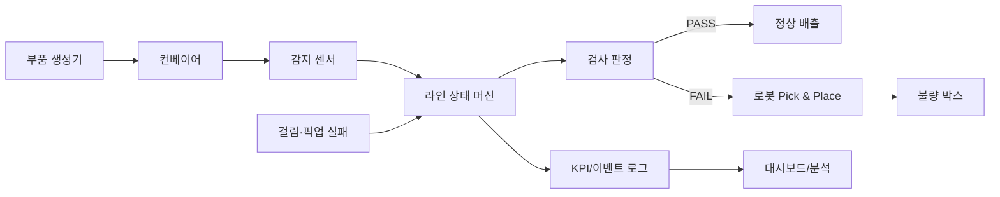
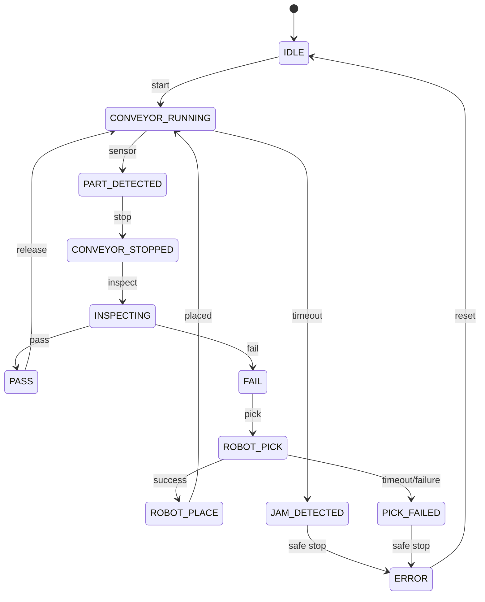

# 시스템 아키텍처

## 런타임 흐름



`inspection_cell` 패키지는 설비 SDK와 독립된 도메인 코어다. Isaac Sim 어댑터가 센서 이벤트를 코어에 전달하고, 코어의 명령을 컨베이어·로봇 API 호출로 변환한다. 이 경계를 유지하면 장면을 열지 않고도 상태 전이와 수치를 검증할 수 있다.

## 상태 머신



허용 전이는 `state_machine.py` 한 곳에서 관리한다. 정의되지 않은 전이는 즉시 예외로 처리해 조용한 상태 오염을 막는다.

## OpenUSD 구성

```text
cells/quality_inspection_cell.usda       # Stage 진입점, 아래 레이어 집계
  ├─ layers/layout.usda                  # layouts/factory_layout.usda Reference
  ├─ layers/physics.usda                 # Collider/Rigidbody/Drive override
  ├─ layers/behavior.usda                # 센서·제어용 속성 override
  ├─ layers/materials.usda               # 재질 override
  └─ layers/lighting.usda                # 조명·시각화
```

- `assets/`: 다운로드한 원본 에셋과 라이선스 정보를 함께 보관한다.
- `layouts/`: 장비 위치와 셀 계층만 담당한다.
- `layers/`: 책임별 override를 담고 원본 모델을 직접 수정하지 않는다.
- 반복 펜스·박스·부품은 instanceable Reference를 우선 사용한다.
- 정상/고속 운전, 제품 종류처럼 교체 가능한 구성은 Variant 후보로 둔다.

현재 USDA 파일은 에셋 경로가 정해지기 전에도 열 수 있는 구성 스켈레톤이다. 실제 에셋 도입 후 `factory_layout.usda`의 placeholder Xform을 Reference prim으로 교체한다.

## 코드 책임

| 모듈 | 책임 |
|---|---|
| `state_machine.py` | 상태와 유효 전이 |
| `inspection_controller.py` | 재현 가능한 PASS/FAIL 판정 |
| `fault_manager.py` | 걸림/픽업 실패 조건 |
| `metrics_collector.py` | 카운트, 불량률, 평균 사이클타임 |
| `line_controller.py` | 한 사이클의 순서 조정과 안전 정지 |
| `adapters/isaac_sim.py` | Isaac Sim 센서·구동기 연결 경계 |

